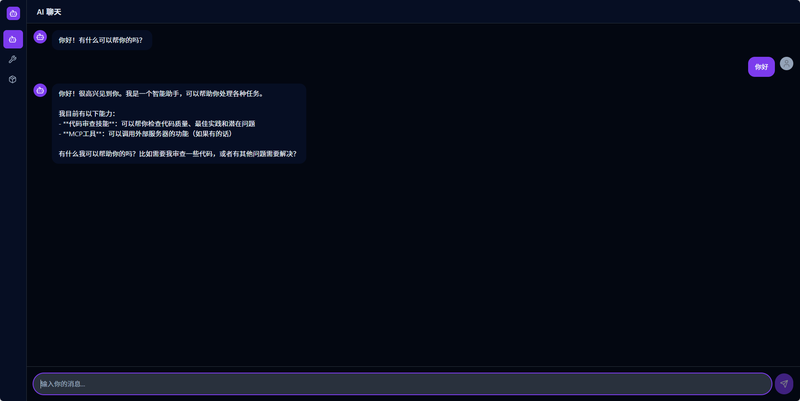

# Agent Demo

<div align="center">

An extensible AI Agent Demo framework with MCP, Skills, and more

[](https://www.python.org/downloads/)
[](https://fastapi.tiangolo.com/)
[](https://react.dev/)
[](LICENSE)

</div>

---

## 📖 Overview

Agent Demo is a modern AI Agent framework with a separated architecture. The backend is built on FastAPI supporting MCP protocol and Skills system, while the frontend is built on React + Vite with a sleek dark theme.

## ✨ Key Features

- 🔌 **MCP Protocol Support**: Full support for Model Context Protocol, connecting to various MCP servers
- 🎯 **Skills System**: Flexible skill management with zip package loading and dynamic management
- 🤖 **Multi-Model Support**: Support for OpenAI-compatible LLM services (OpenAI, DeepSeek, Claude, etc.)
- 🚀 **RESTful API**: Complete HTTP API interface
- 📦 **Modular Architecture**: Clear layered design for easy maintenance and extension
- ⚡ **Async Processing**: High-performance async architecture based on asyncio
- 🎨 **Dark Theme UI**: Modern React frontend with dark theme
- 🔧 **Tool Calling**: Support for automatic tool calling and multi-turn conversations

## 🛠️ Tech Stack

### Backend
- **FastAPI** - Modern high-performance web framework
- **Pydantic** - Data validation and settings management
- **OpenAI SDK** - OpenAI API client
- **MCP SDK** - Model Context Protocol SDK

### Frontend
- **React 18** - UI library
- **Vite** - Build tool and dev server
- **TypeScript** - Type safety
- **Tailwind CSS** - Utility-first CSS
- **Lucide React** - Icon library

## 🚀 Quick Start

### Requirements

- Python 3.12 or higher
- Node.js 18 or higher
- pnpm package manager
- uv package manager

### Installation

#### 1. Backend

```bash
cd backend

# Create virtual environment
uv venv

# Install dependencies
uv sync

# Configure environment variables
cp .env.example .env
# Edit .env file with your configuration
```

#### 2. Frontend

```bash
cd frontend

# Install dependencies
pnpm install
```

### Running the Application

#### Start Backend (in backend/ directory)

```bash
uv run uvicorn app.main:app --host 0.0.0.0 --port 8002
```

#### Start Frontend (in frontend/ directory)

```bash
pnpm dev
```

The frontend will start at `http://localhost:5173` and automatically proxy API requests to the backend at `http://localhost:8002`.

## 📝 Configuration

### Backend Environment Variables

Configure the following variables in `backend/.env` file:

```env
# LLM Configuration
OPENAI_API_KEY=your_api_key_here
OPENAI_API_BASE=https://api.deepseek.com/v1
LLM_MODEL=deepseek-chat
TEMPERATURE=0.7
MAX_RETRIES=3

# MCP Configuration
MCP_CONFIG_PATH=mcp.json

# Skills Configuration
SKILLS_DIRECTORY=storage/skills
SKILLS_EXTRA_DIRS=                    # Extra skill directories (comma-separated)
SKILLS_MAX_IN_PROMPT=50              # Max skills in prompt before switching to compact format
SKILLS_MAX_PROMPT_CHARS=8000         # Max characters before switching to compact format
```

### MCP Server Configuration

Configure MCP servers in `backend/mcp.json`:

```json
{
  "mcpServers": {
    "server-name": {
      "url": "http://localhost:3000/mcp",
      "description": "Server description"
    }
  }
}
```

## 🎯 Features

### 1. Chat Interface

Modern dark-themed chat interface with:
- Multi-turn conversation support
- Automatic tool calling display
- Loading states


### 2. MCP Tool Management

- View all available MCP tools
- Refresh to reload tools from MCP servers
- Call tools directly from the UI

### 3. Skills System

- Upload skills as .zip packages
- View installed skills
- Delete skills
- Hot reload: Skills are automatically reloaded when files change
- Token optimization: Auto-switches to compact format when limits exceeded

## 📁 Project Structure

```
agent-demo/
├── frontend/              # React + Vite frontend
│   ├── src/
│   │   ├── api/          # API calls
│   │   ├── components/    # React components
│   │   ├── types/        # TypeScript types
│   │   └── App.tsx       # Main app
│   └── package.json
│
├── backend/               # FastAPI backend
│   ├── app/             # Application layer
│   ├── core/            # Core utilities
│   ├── llm/             # LLM integration
│   ├── mcp_client/      # MCP client
│   ├── models/          # Data models
│   ├── skills/         # Skills management
│   └── storage/        # File storage
│
├── README.md
├── README_CN.md
└── AGENTS.md
```

## 🐛 Troubleshooting

#### Skill Not Loading
- Check if SKILL.md file exists in the zip
- Verify YAML frontmatter format
- Ensure name and description fields exist
- Skill names with special characters (like `:`) are sanitized for Windows compatibility

#### MCP Connection Failed
- Check if MCP server is running
- Verify mcp.json configuration
- Click refresh button to reload tools

#### Frontend API Errors
- Ensure backend is running on port 8002
- Check CORS settings in backend

## 🤝 Contributing

Contributions are welcome! Feel free to contribute code, report issues, or suggest ideas for fun projects!

## 📄 License

This project is licensed under the MIT License.

## 🙏 Acknowledgments

- [FastAPI](https://fastapi.tiangolo.com/) - Modern high-performance web framework
- [React](https://react.dev/) - UI library
- [Vite](https://vitejs.dev/) - Build tool
- [MCP](https://modelcontextprotocol.io/) - Model Context Protocol
